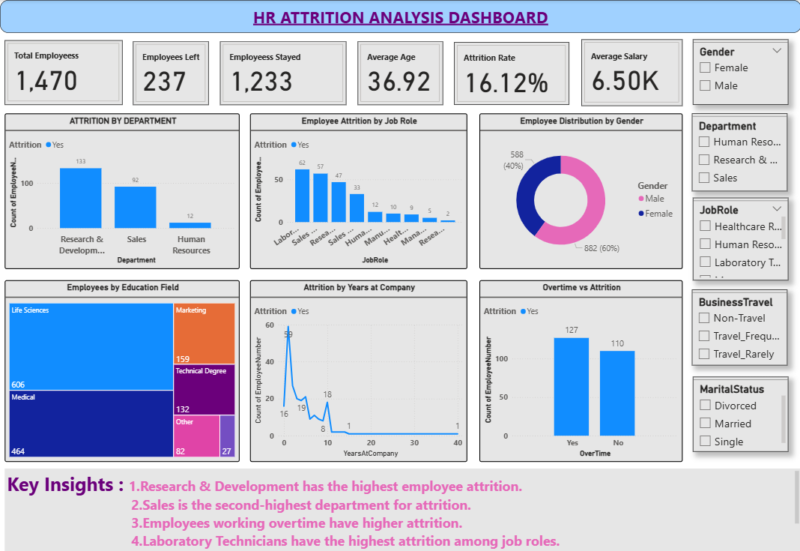

# HR Employee Attrition Analysis Dashboard

An interactive HR Employee Attrition Analysis Dashboard built using **Microsoft Power BI, SQL, and DAX**.

## 📊 Project Overview

This project analyzes employee attrition data to identify important patterns and factors associated with employee turnover.

The dashboard provides insights into:

- Total Employees
- Employees Who Left
- Employees Who Stayed
- Attrition Rate
- Average Age
- Average Salary
- Attrition by Department
- Attrition by Job Role
- Employee Distribution by Gender
- Employees by Education Field
- Attrition by Years at Company
- Overtime and Attrition

## 🛠️ Tools & Technologies

- Microsoft Power BI
- SQL
- DAX
- Microsoft Excel
- Data Visualization
- Data Analysis

## 📈 Key KPIs

| KPI | Value |
|---|---:|
| Total Employees | 1,470 |
| Employees Left | 237 |
| Employees Stayed | 1,233 |
| Attrition Rate | 16.12% |
| Average Age | 36.92 |

## 🔍 Key Insights

1. Research & Development has the highest number of employee attritions.
2. Sales has the second-highest employee attrition.
3. Employees working overtime show significant attrition.
4. Laboratory Technician is among the job roles with higher attrition.
5. The dashboard allows HR teams to analyze attrition using multiple employee dimensions.

## 📊 Dashboard Preview

## 📂 Project Files

- `HR_Attrition_Analysis.pbix` – Power BI dashboard file
- `HR_Attrition_Dashboard.png` – Dashboard preview
- `hr_attrition.sql` – SQL queries used for analysis
- `DAX_Measures.txt` – DAX measures used in Power BI

## 🎯 Project Objective

The objective of this project is to analyze employee attrition and identify workforce patterns that can help organizations understand employee turnover and support data-driven HR decisions.

## 👩‍💻 Author

**Vaishnavi Mahangare**

BE Artificial Intelligence & Machine Learning
